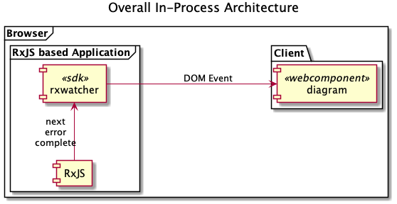
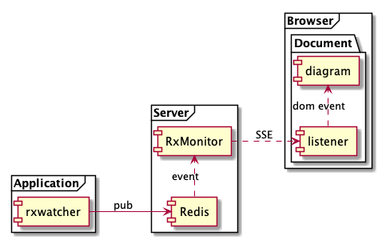
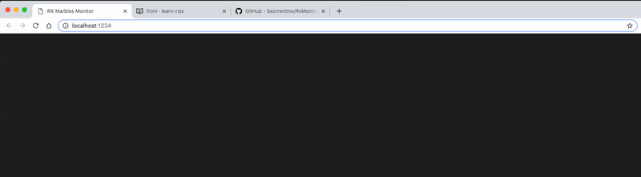
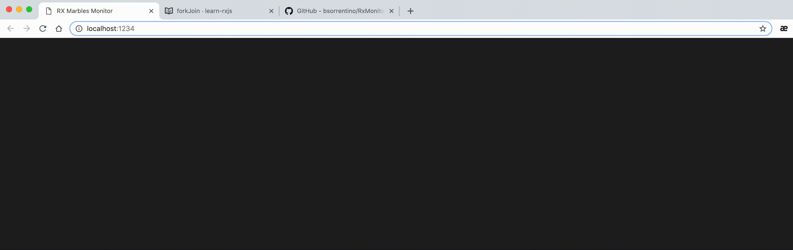

# RxMonitor
ReactiveX Async Stream Monitoring using Marble Diagrams. Idea is to create ad-hoc operators that send all the streams' activities to a monitor console that will show up such information using marble diagrams

The plan is to create such operators to monitor application based on :
1. [rxjs](https://github.com/ReactiveX/rxjs) - that run both in the browser and nodejs
2. [rxjava](https://github.com/ReactiveX/rxjava) / [reactor](https://github.com/reactor)


> Inspired by [Rx Marbles](http://users.telenet.be/jo.van.den.berghe/rx/#shapes) from [Jo Van den Berghe](http://users.telenet.be/jo.van.den.berghe/)  


## Similar Projects

 project | description
--- | ---
[rxjs-watcher](https://github.com/xripcsu/rxjs-watcher) | Simple chrome devtools extension to visualize Rxjs observables.
[rx-devtools](https://github.com/KwintenP/rx-devtools) | This is a chrome extension that can be used to visualize RxJS streams in realtime.
[rxmarbles](https://stackblitz.com/edit/rxmarbles) | Angular project for live RxMarbles

## Architecture






## Getting Started

> Currently only the In-Process RxJS is available

1. **Checkout Project**
2. **go to `client` folder**
3. **run `npm install`**
4. **run `npm run serve`**
5. **open url `http://localhost:1234/`**`

## Live Demo

A live demo has been deployed on **heroku** [here](https://rxmonitor.herokuapp.com/index.html)

## Examples

### forkJoin

#### extract from [learn-rxjs](https://www.learnrxjs.io/operators/combination/forkjoin.html)
```javascript
let forkJoin$ = () => {

const myPromise = (val:any) =>
  new Promise(resolve => {
    let t = generateRandomNumber( 5000, 10000);
    setTimeout(() => resolve(`res: ${val}`), t )
  })

const source = of([1, 2, 3, 4, 5, 6, 7, 8]);

const example = source.pipe( mergeMap(q => forkJoin(...q.map(myPromise))) );

return example.subscribe(val => console.log(val));

}
```

#### Add monitoring operator

```javascript
import { watch } from 'marble-rxjs';

let forkJoin$ = () => {

let watchResult = <T>() => watch<T>('forkJoin');
let watchStream = <T>( id:string ) => watch<T>(id, 'forkJoin');

const myPromise = (val:any) =>
    new Promise(resolve => {
      let t = generateRandomNumber( 5000, 10000);
      setTimeout(() => resolve(`res: ${val}`), t )
  });

const myObservable = from(myPromise).pipe(watchStream("promise"));

const source = of([1, 2, 3, 4, 5, 6, 7, 8]).pipe( watchStream( 'of' ));

const example = source.pipe( mergeMap(q => forkJoin(...q.map(myObservable))), watchResult() );

return example.subscribe(val => console.log(val));

}
```

### Result



## combineLatest

#### extract from [learn-rxjs](https://www.learnrxjs.io/operators/combination/combinelatest.html)
```javascript
let combineLatest$ = () => {

const timerOne = timer(1000, 4000);
const timerTwo = timer(2000, 4000);
const timerThree = timer(3000, 4000);

const combined = combineLatest(timerOne, timerTwo, timerThree);

return combined.subscribe(
  ([timerValOne, timerValTwo, timerValThree]) => {
    console.log(
      `
      Timer One Latest: ${timerValOne},
      Timer Two Latest: ${timerValTwo},
      Timer Three Latest: ${timerValThree}
      `
    );
  }
);

}
```

#### Add monitoring operator

```javascript
import { watch } from 'marble-rxjs';

let combineLatest$ = () => {

let watchResult = <T>() => watch<T>('combineLatest');
let watchStream = <T>( id:string ) => watch<T>(id, 'combineLatest');

const timerOne = timer(1000, 4000).pipe( watchStream('timerOne') );
const timerTwo = timer(2000, 4000).pipe( watchStream('timerTwo') );
const timerThree = timer(3000, 4000).pipe( take(2), watchStream('timerThree'));

const combined = combineLatest(timerOne, timerTwo, timerThree)
                        .pipe( take(10), watchResult() );

return combined.subscribe(
  ([timerValOne, timerValTwo, timerValThree]) => {
    console.log(
     `
     Timer One Latest: ${timerValOne},
     Timer Two Latest: ${timerValTwo},
     Timer Three Latest: ${timerValThree}
     `
    );
  }
);

}
```

### Result


