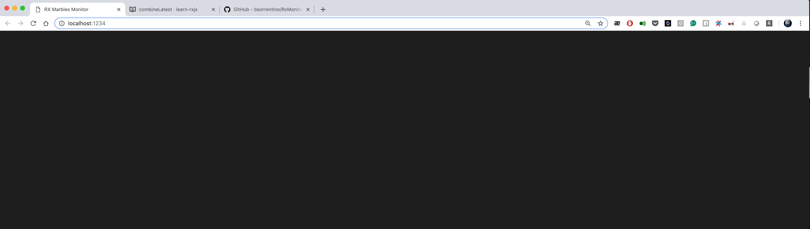
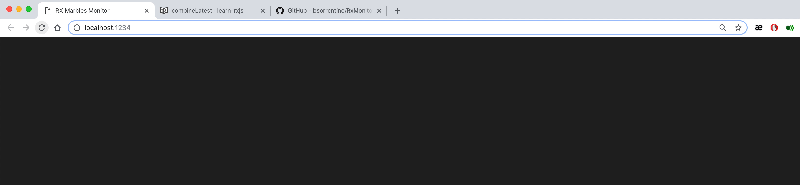

# RxMonitor
ReactiveX Async Stream Monitoring using Marble Diagrams. Idea is to create ad-hoc operators that send all the streams' activities to a monitor console that will show up such information using marble diagrams

The plan is to create such operators to monitor application based on :
1. [rxjs](https://github.com/ReactiveX/rxjs) - that run both in the browser and nodejs
2. [rxjava](https://github.com/ReactiveX/rxjava) / [reactor](https://github.com/reactor)


> Inspired by [Rx Marbles](http://users.telenet.be/jo.van.den.berghe/rx/#shapes) from [Jo Van den Berghe](http://users.telenet.be/jo.van.den.berghe/)  


## Similar Projects

 project | description
--- | ---
[rxjs-watcher](https://github.com/xripcsu/rxjs-watcher) | Simple chrome devtools extension to visualize Rxjs observables.
[rx-devtools](https://github.com/KwintenP/rx-devtools) | This is a chrome extension that can be used to visualize RxJS streams in realtime.
[rxmarbles](https://stackblitz.com/edit/rxmarbles) | Angular project for live RxMarbles


## Examples

### forkJoin

#### [extract from learn-rxjs](https://www.learnrxjs.io/operators/combination/forkjoin.html)
```javascript
let forkJoin$ = () => {

  const myPromise = (val:any) =>
    from(
    new Promise(resolve => {
      let t = generateRandomNumber( 5000, 10000);
      setTimeout(() => resolve(`res: ${val}`), t )
    }))

const source = of([1, 2, 3, 4, 5, 6, 7, 8]);

const example = source.pipe( mergeMap(q => forkJoin(...q.map(myPromise))) );

return example.subscribe(val => console.log(val));

}
```



## combineLatest

#### [extract from learn-rxjs](https://www.learnrxjs.io/operators/combination/combinelatest.html)
```javascript
let combineLatest$ = () => {

const timerOne = timer(1000, 4000);
const timerTwo = timer(2000, 4000);
const timerThree = timer(3000, 4000);

const combined = combineLatest(timerOne, timerTwo, timerThree);

return combined.subscribe(
  ([timerValOne, timerValTwo, timerValThree]) => {
    console.log(
      `
      Timer One Latest: ${timerValOne},
      Timer Two Latest: ${timerValTwo},
      Timer Three Latest: ${timerValThree}
      `
    );
  }
);

}

```


